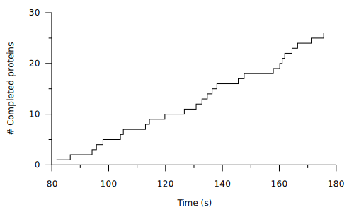
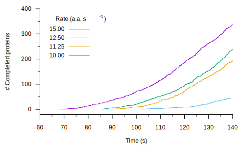
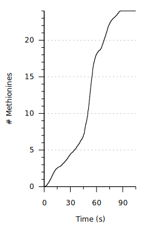

# SIMP'LTON: SIMulating PoLysome TranslatiON

SIMP'LTON is a computer program which models biological translation (ribosomes translating an mRNA). When multiple ribosomes translate a same mRNA, they are said to form a *polysome*. By simulating the effects of *microscopic variables*, the position-specific codon translation rates, we aim to recapitulate *macroscopic experimental observables*:

- protein production rates
- ribosome occupancy the mRNA
- codon step times
- translation initiation rates
- the rate of incorporation of labeled amino acids into nascent polypeptides (*i.e.* pulse-chase experiments)

SIMP'LTON makes simplifying assumptions about translation: that each codon has an invariant, exponentially distributed translation rate, meaning that translation initiation and termination each happen in a single step, and translation elongation at each codon position happens in a single step. The focus is on the interplay between fast and slow translation rates, rather than any particular molecular mechanism. Nevertheless, SIMP'LTON recapitulates numerous experimental results from the literature.

## Illustrations

### Protein production



### The delay time assay



### The pulse chase assay



## About the algorithm

SIMP'LTON is written in the [Rust](https://www.rust-lang.org) programming language. Rust delivers excellent performance (comparable to *e.g.* C), supports multi-processing with minimal overhead, and is cross-platform and free software. Significant effort has been made to keep the SIMP'LTON codebase minimal (~2,200 lines). The core logic of the simulation is ~350 lines of code. The output is recorded as [Apache Parquet](https://parquet.apache.org), a high-performance columnar data storage format designed for storing large datasets, compatible with popular dataframe processing tools, including [Polars](https://pola.rs/). After running simulations, Polars is used to convert the microscopic events into macroscopic observables.

The SIMP'LTON algorithm is a variation of the classic stochastic ("[Gillespie](https://en.wikipedia.org/wiki/Gillespie_algorithm)") algorithm, which iteratively samples exponentially distributed reaction rates to choose the next reaction along with its corresponding time increment. A key element of the algorithm is that ribosomes which are sterically hindered will not be able to advance, regardless of the codon's intrinsic rate value.

## Features

- Replicates: run multiple simulations in parallel to generate replicates for improved statistical power. These mRNAs do not communicate with each other and do not share molecular resources (*i.e.* each polysome is isolated).
- Programmed events: one or more rates is altered at a pre-determined, deterministic time. This feature can be used to model experimental interventions, such as the addition of inhibitor (one or more rates goes to zero), or the change in concentration of a tRNA species (rates at specific codon positions, requiring a corresponding tRNA, adopt a new value).
- Randomized transcription: instead of a fixed number of parallel simulations all starting at time zero, stochastically generate new transcripts over time with an exponentially distributed event frequency.
- mRNA Decay: add an exponentially distributed decay term to each transcript. Decay will prevent an mRNA from engaging in any additional translation initiation events, but actively translating ribosomes will continue to translate. (NOTE: If desired, one can model complete, instantaneous decay of the entire mRNA by scripting simulations (using *e.g.* Python) with randomly selected simulation durations.)
- Flexible ribosome footprint length and A-site position within the footprint.
- Warmup time: this can be used to allow the system to reach a steady-state before computing statistics by ignoring all events prior to the warmup time.

## Installation

A Rust compiler is required to install this software. Please see the [official documentation](https://www.rust-lang.org/tools/install) on how to install Rust and to compile Rust programs using Cargo.

## License

SIMP'LTON is licensed under the [Affero GPL](www.gnu.org/license/agpl-3.0.en.html) version 3.

## Running SIMP'LTON

After compiling the software, an executable binary file called *simplton* will be generated. This binary contains three *sub-commands*:

1. **simulate**: The *simulate* sub-command performs the initial simulation and outputs two files: 1. trajectories 2. mRNA start times.
2. **statistics**: The *statistics* command generates macroscopic observable statistics of a simulation by reading in the trajectories and mRNA start times.
    * ribosome collision frequencies
    * nascent peptide length distributions
    * overall step times
    * mean step times per codon position
    * average final ribosome occupancies
    * protein production for each mRNA
    * total protein production
    * spacing between ribosomes
    * protein synthesis times
3. **pulse-chase**: The *pulse-chase* sub-command performs a pulse-chase analysis of a pre-existing simulation.

## File format

Simulation results are written in the [Apache Parquet](https://parquet.apache.org) file format as implemented by the [arrow2](https://github.com/jorgecarleitao/arrow2) Rust software library. Data processing by [Polars](https://docs.rs/polars/latest/polars/) is also stored as Parquet.

## Scripting

A good way to run simulations in a systematic way, while documenting the simulation parameters, is by using simple scripts, *e.g.* BASH. Please refer to the examples below for inspiration:

### Example 1 --- 

```
#!/bin/bash

## Variables
# Output directory (parent)
OUT_DIR="out"

# Includes stop codon
num_codons=1025
init_rate=1.33
term_rate=10.0

# Compare different elongation rates
elong_rates=( 10.0 11.25 12.50 15.0 )

## Simulation
num_threads=4
simulation_time=140.0
num_mRNA=100

for elong_rate in "${elong_rates[@]}"; do
    echo "Running simulation with elongation rate $elong_rate"
    OUT="${OUT_DIR}/${elong_rate}"
	mkdir -p $OUT
    
    rates_string="${init_rate}:1,${elong_rate}:2:1024,${term_rate}:${num_codons}"

    echo "Simulation"
    simplton simulate \
	     -t "$simulation_time" \
	     -o "$OUT" \
	     -n "$num_mRNA" \
	     -r "$rates_string" \
	     -T "$num_threads" \
	     -v

    echo "Statistics"
    simplton statistics \
	     -t "$OUT/trajectories.pq" \
	     -m "$OUT/mRNA_start_times.pq" \
	     -n "$num_codons" \
	     -o "$OUT"

done
```

### Example 2 --- 

```
#!/bin/bash

## Variables

# Includes stop codon
num_codons=1025
term_rate=10.0
init_rate=1.33
elong_rate_slow=9.0
elong_rate_fast=13.5

# Simulation
num_threads=4
simulation_time=180.0
num_mRNA=1000

# Pulse-chase
pulse_time=90.0
chase_time=100.0

## Sim # 1

echo "Running simulation with only fast codons"
OUT="fast"
mkdir -p $OUT

rates_string="${init_rate}:1,${elong_rate_fast}:2:1024,${term_rate}:${num_codons}"

echo "Simulation"
simplton simulate \
	 -t "$simulation_time" \
	 -o "$OUT" \
	 -n "$num_mRNA" \
	 -r "$rates_string" \
	 -T "$num_threads" \
	 -v

echo "Statistics"
simplton statistics \
	 -t "$OUT/trajectories.pq" \
	 -m "$OUT/mRNA_start_times.pq" \
	 -n "$num_codons" \
	 -o "$OUT"

echo "Pulse chase"
simplton pulse-chase \
	 -t "$OUT/trajectories.pq" \
	 -o "$OUT/pc.pq" \
	 -p "$pulse_time" \
	 -c "$chase_time"

## Sim # 2

echo "Running simulation with only slow codons"
OUT="slow"
mkdir -p $OUT

rates_string="${init_rate}:1,${elong_rate_slow}:2:1024,${term_rate}:${num_codons}"

echo "Simulation"
simplton simulate \
	 -t "$simulation_time" \
	 -o "$OUT" \
	 -n "$num_mRNA" \
	 -r "$rates_string" \
	 -T "$num_threads" \
	 -v

echo "Statistics"
simplton statistics \
	 -t "$OUT/trajectories.pq" \
	 -m "$OUT/mRNA_start_times.pq" \
	 -n "$num_codons" \
	 -o "$OUT"

echo "Pulse chase"
simplton pulse-chase \
	 -t "$OUT/trajectories.pq" \
	 -o "$OUT/pc.pq" \
	 -p "$pulse_time" \
	 -c "$chase_time"

## Sim # 3

echo "Running simulation with fast & slow codons"
OUT="slow_fast"
mkdir -p $OUT

rates_string="${init_rate}:1,${elong_rate_slow}:2:250,${elong_rate_fast}:251:1024,${term_rate}:${num_codons}"

echo "Simulation"
simplton simulate \
	 -t "$simulation_time" \
	 -o "$OUT" \
	 -n "$num_mRNA" \
	 -r "$rates_string" \
	 -T "$num_threads" \
	 -v

echo "Statistics"
simplton statistics \
	 -t "$OUT/trajectories.pq" \
	 -m "$OUT/mRNA_start_times.pq" \
	 -n "$num_codons" \
	 -o "$OUT"

echo "Pulse chase"
simplton pulse-chase \
	 -t "$OUT/trajectories.pq" \
	 -o "$OUT/pc.pq" \
	 -p "$pulse_time" \
	 -c "$chase_time"

```

## Programmed events

To modify translation rates in the middle of a simulation use an events file formatted as so:

```
# Pre-program rate changes at specific times
# Format:
# time (f32) \t [pos1,pos2,pos3 ... (int)] \t [rate1,rate2,rate2 ... (f32)]

# Inhibit translation initiation at 25.0 seconds
25.0	0	0.0

# Change codons at positions 100, 200, and 300 to 5.0 / sec at 60.0 seconds
60.0	100,200,300	5.0,5.0,5.0

```

## Translation rates: string, or file

Translation rates are set by 1 of 2 methods:

- a string
- a text file

All rates are encoded as 32-bit floating point. All positions are integers, with the start codon being position 1.

### String format

The string format is easier to input *on-the-fly*. It consists of comma-separated chunks. Each chunk in turn is colon-delimited, and has 2 or 3 components:

`rate:start_position:end_position`

All positions between start and end, inclusive, will be set to that rate. The end position is optional.

Example:

`0.5:1,10.0:2:99,15.0:100:150,5.0:151`

will set the translation initiation rate to 0.5 s<sup>-1</sup>, followed by translation elongation rates of 10.0 s<sup>-1</sup> from codons 2 to 99, 15.0 <sup>-1</sup> from codons 100 to 150, and translation termination rate of 5.0 <sup>-1</sup> at the stop codon (position 151).

### Text format

Input a TSV (tab separated values) file, with 2 columns: 1. codon position 2. rate. This format can be easier to work with if there are many different rates across the length of the mRNA and it's tedious to input them manually.

## Future features wish list
- Create additional sub-commands for each Polars statistics calculation, to run each calculation independently if desired

## References

### Simulations
1. Gillespie, D. T. (1977) Exact stochastic simulation of coupled chemical reactions. *The Journal of Physical Chemistry* **81** (25), 2340-2361. https://doi.org/10.1021/j100540a008
2. von der Haar, T. (2012) Mathematical and computational modelling of ribosomal movement and protein synthesis: an overview. *Computational and Structural Biotechnology Journal* **1** (1). https://doi.org/10.5936/csbj.201204002

### *In vivo* translation measurements in *E. coli*
1. Schleif, R., Hess, W., Finkelstein, S. and D. Ellis. (1973) Induction kinetics of the L-arabinose operon of *Escherichia coli*. *Journal of Bacteriology* **115** (1), 9-14. https://doi.org/10.1128/jb.115.1.9-14.1973
2. Dalbow, D. G. and Young, R. (1975) Synthesis time of β-Galactosidase in *Escherichia coli* B/r as a function of growth rate. *Biochemical Journal* **150**, 13-20. https://doi.org/10.1042/bj1500013
3. Sørensen, M. A., Kurland, C. G. and Pedersen, S. (1988) Codon usage determines translation rate in *Escherichia coli*. *Journal of Molecular Biology* **207** (2), 365-377. https://doi.org/10.1016/0022-2836(89)90260-X
4. Sørensen, M. A. and Pedersen, S. (1991) Absolute *in vivo* translation rates of individual codons in *Escherichia coli*. *Journal of Molecular Biology* **222** (2), 265-280. https://doi.org/10.1016/0022-2836(91)90211-N
5. Sørensen, M. A. and Pedersen, S. (1998) Determination of the peptide elongation rate in vivo. *Methods in Molecular Biology* **77** (6), 129-142. https://doi.org/10.1385/0-89603-397-X:129

### The positioning of the active sites in ribosome footprints
1. Martens, A. T., Taylor, J. and Hilser, V. J. (2015) Ribosome A and P sites revealed by length analysis of ribosome profiling data. *Nucleic Acids Research* **43** (7), 3680-3687. https://doi.org/10.1093/nar/gkv200
2. Woolstenhulme, C. J., Guydosh, N. R., Green, R. and Buskirk, A. R. (2015) High-precision analysis of translational pausing by ribosome profiling in bacteria lacking EFP. *Cell Reports* **11** (1), 13-21. https://doi.org/10.1016/j.celrep.2015.03.014

## Contact

You can reach Andrew T. Martens by e-mail at [simplton@logical.bio](mailto:simplton@logical.bio).
